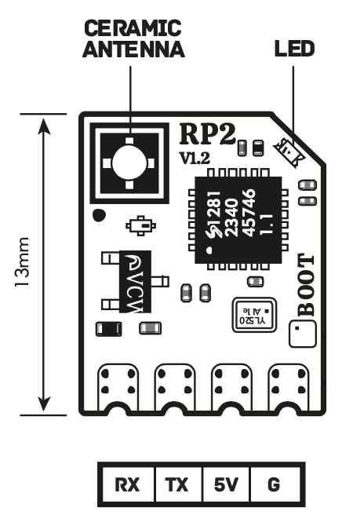

# liftoff-rs

Tools and background services for CRSF joystick and telemetry, to use the quadcopter sim "liftoff" in hardware-in-the-loop simulation:

```
 ┏━━━━━━━┓
 ┃ radio ┃
 ┗━━━▲━━━┛
     ┆
     ┆ ELRS
     ┆
┏━━━━▼━━━━━┓
┃   ELRS   ┃        ┌─────────┐     ┌───────┐
┃ receiver ◀────────▶ forward ◀─────▶ input ▶─────────┐
┗━━━━━━━━━━┛ serial └─────────┘ UDP └───▲───┘         │
             CRSF               CRSF    │             │ uinput
                                        │ UDP tlm     │
                                   ┌────▲───┐     ╔═══▼═════╗
                                   │ router ◀─────◀ liftoff ║
                                   └────▼───┘ UDP ║   sim   ║
                                    UDP │     tlm ╚═════════╝
                                    tlm │         
 ─ this repository                  ┌───▼──┐       ╔══════╗
 ═ external software                │ gpsd ▶───────▶ QGIS ║
 ━ hardware                         └──────┘       ╚══════╝
```
                                                             
- `liftoff-forward`: CRSF forwarder. Forward CRSF control and telemetry between a ELRS receiver UDP sockets
- `liftoff-gpsd`: gpsd emulator for viewing liftoff telemetry in QGIS
- `liftoff-router`: Telemetry router. Receives liftoff's native UDP telemetry and broadcasts it to subscribers
- `liftoff-input`: CRSF joystick. Receives CRSF packets over UDP and simulates a linux udev joystick. Sends back telemetry from liftoff to UDP

This project makes use of `tokio` for reliable, high-performance asynchronous I/O.

## Hardware

Any kind of ELRS receiver module will do.



The one that was used during development is a Radiomaster RP2 V2 ExpressLRS 2.4ghz Nano RX, soldered to an USB-serial dongle. The USB-serial dongle needs to be stable at the non-standard baudrate of `420000`. The I/O voltage is for ELRS receivers is 5V. To wire it directly to a Raspberry Pi's GPIO pins, which have a logic level of 3.3V, a level converter is needed.

```
┌────┬────┬────┬────┐
│ RX │ TX │ 5V │ G  │  ELRS receiver
└──▲─┴──▼─┴──■─┴──■─┘
   │   ┌┘    │    │
   └───│┐    │    │
   ┌───┘│    │    │
   │    │    │    │
┌──▼─┬──▲─┬──■─┬──■─┐
│ RX │ TX │ 5V │ G  │  USB-serial
└────┴────┴────┴────┘
```

Make sure to bind your ELRS radio with the receiver, either through a binding phrase or triple-power-cycle.

## Setting up the software

### Setting up liftoff's telemetry stream

Create a file `TelemetryConfiguration.json` in liftoff's game configuration directory, with the following contents:

```json
{
  "EndPoint": "127.0.0.1:9001",
  "StreamFormat": [
    "Timestamp",
    "Position",
    "Attitude",
    "Velocity",
    "Gyro",
    "Input",
    "Battery",
    "MotorRPM"
  ]
}
```

On Linux this will usually be `~/.config/unity3d/LuGus Studios/Liftoff/`. The exact path depends on the operating system and/or install location. Details can be found here: [Liftoff - Drone Telemetry](https://steamcommunity.com/sharedfiles/filedetails/?id=3160488434). This also works for Liftoff: Micro Drones.

### Building

```
cargo build --release
cargo test --release
```

### Running

Below are the command-line help for the all the services. All services are optional. For example, if you don't use `gpsd`, there is no need to run it.

```
$ target/release/liftoff-forward --help
Usage: liftoff-forward [OPTIONS]

Options:
  -p, --port <PORT>
          Serial port to use [default: /dev/ttyUSB0]
  -b, --baud <BAUD>
          Serial baudrate to use [default: 420000]
      --dest <DEST>
          Destination for UDP packets [default: 127.0.0.1:9005]
      --src <SRC>
          Source (bind) for UDP packets [default: 127.0.0.1:9006]
      --metrics-tcp
          Enable metrics reporting using metrics-rs-tcp-exporter
      --metrics-tcp-bind <METRICS_TCP_BIND>
          Bind address for metrics-rs-tcp-exporter [default: 127.0.0.1:5000]
  -h, --help
          Print help
  -V, --version
          Print version
```

```
Usage: liftoff-router [OPTIONS]

Options:
      --cmd-bind <CMD_BIND>  Bind address for telemetry router [default: 127.0.0.1:9003]
      --tel-bind <TEL_BIND>  Bind address for incoming telemetry [default: 127.0.0.1:9001]
  -h, --help                 Print help
  -V, --version              Print version
```

```
Usage: liftoff-gpsd [OPTIONS]

Options:
      --gpsd-bind <GPSD_BIND>            Bind address for GPSD service [default: 127.0.0.1:2947]
      --telemetry-addr <TELEMETRY_ADDR>  Address of telemetry router [default: 127.0.0.1:9003]
  -f, --frequency <FREQUENCY>            GPS position update frequency [default: 10]
  -h, --help                             Print help
  -V, --version                          Print version
```

```
Usage: liftoff-input [OPTIONS]

Options:
      --bind <BIND>
          Bind address for incoming CRSF UDP packets [default: 127.0.0.1:9005]
      --telemetry-addr <TELEMETRY_ADDR>
          Address of telemetry router [default: 127.0.0.1:9003]
  -h, --help
          Print help
  -V, --version
          Print version
```

### Setting up liftoff's input

In-game, `liftoff-input` will appear as `CRSF joystick`. Select this and calibrate it.

The RC channel values to joystick axis/button mappings are currently hard-coded in the function [InputState::update](liftoff-input/src/main.rs#L117).

## Diagnostics

### Logging

This project makes use of `env_logger` and uses the standard log verbosity levels and environment variables. For example, to show info level messages and up,

```
RUST_LOG=info target/release/liftoff-forward -p /dev/... -b 420000 ...
```

To get super-verbose output for troubleshooting, use debug level `debug` or `trace`. The idea is that `debug` summarizes all I/O events, and `trace` shows the raw content of packets.

### Metrics

The services make use of `metrics-rs` to track internal metrics for observability,

```
target/release/liftoff-forward --metrics-tcp --metrics-tcp-bind 127.0.0.1:5000
```

These can then be connected to and shown using, for example, [metrics-observer](https://github.com/metrics-rs/metrics/tree/main/metrics-observer).

