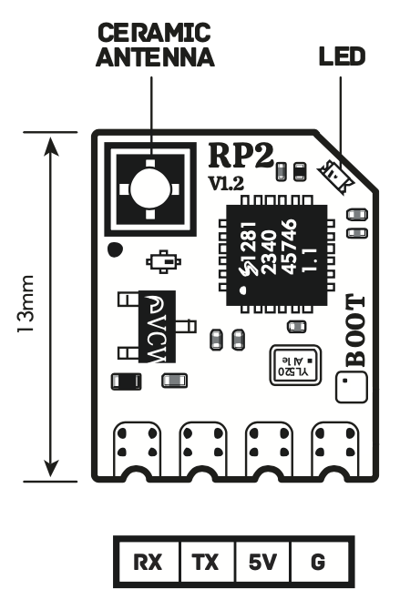
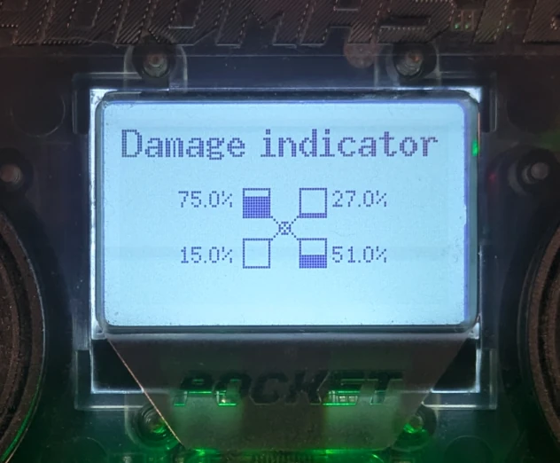

# liftoff-rs

Tools and background services for CRSF joystick, telemetry, and autopilot, to use a quadcopter sim in hardware-in-the-loop simulation. Services communicate over [Zenoh](https://zenoh.io/) pub/sub over UDP.

Primary target is [Liftoff](https://store.steampowered.com/app/410340/), with additional bridges for [Velocidrone](https://store.steampowered.com/app/1631290/) and [Uncrashed](https://store.steampowered.com/app/1682970/) — once any of them publishes a CRSF telemetry stream, the rest of the stack (autopilot, dashboard, gpsd) doesn't care which sim is upstream.

```
 ┏━━━━━━━┓                                    ╔════════════════════════╗
 ┃ radio ┃                                    ║          sim           ║
 ┗━━━▲━━━┛                                    ║  Liftoff / Velocidrone ║
     ┆ ELRS                                   ║   / Uncrashed          ║
 ┏━━━▼━━━━━━┓                                 ╚════▲══════════════▼════╝
 ┃ receiver ┃                                      │ uinput       │ telemetry
 ┗━━━▲━━━━━━┛                                      │              │ (UDP / WS / file)
     │ serial CRSF                            ┌────▲──────┐  ┌────▼─────────┐
     │                                        │   crsf-   │  │   *-input    │
 ┌───▼─────┐                                  │ joystick  │  │   bridges    │
 │  crsf-  │                                  └─────▲─────┘  └──────▼───────┘
 │ forward │                                        │               │
 └────▲────┘                                        │ crsf/rc       │ crsf/telemetry
      │ crsf/rc, crsf/telemetry              + crsf/rc/autopilot    │
      │                                             │               │
 ┌────▼─────────────────────────────────────────────▲───────────────▼───┐
 │                          Zenoh pub/sub                               │
 └──▲─────────────────▼──────────────────▼──────────────────▲───────────┘
    │ crsf/telemetry  │ crsf/telemetry   │ crsf/telemetry   │ mavlink
    │ mavlink         │                  │                  │
 ┌──▼───────┐   ┌─────▼───────┐    ┌─────▼────┐     ┌───────▼────────┐
 │autopilot │   │  telemetry- │    │  crsf-   │     │ mavlink-bridge │
 │          │   │  dashboard  │    │   gpsd   │     │                │
 └────▼─────┘   └─────────────┘    └─────▼────┘     └─────────▲──────┘
      │ crsf/rc/autopilot                │ NMEA               │ MAVLink
      └─▶ (back into Zenoh)              │                    │ (UDP)
                                      ╔══▼═══╗            ╔═══▼═══╗
                                      ║ QGIS ║            ║  GCS  ║
                                      ╚══════╝            ╚═══════╝

 ─ this repository
 ═ external software
 ━ hardware
```

- `crsf-forward`: CRSF forwarder. Bridges CRSF RC channels and telemetry between an ELRS serial receiver and Zenoh
- `crsf-joystick`: Virtual joystick service. Subscribes to CRSF RC channels from both manual (`crsf/rc`) and autopilot (`crsf/rc/autopilot`) Zenoh topics, muxes them based on radio presence and the SA switch, and emits a Linux uinput device named `CRSF Joystick` that any sim picks up as a regular controller. Sim-agnostic — the same binary works for Liftoff, Velocidrone, and Uncrashed
- `liftoff-input`: Liftoff telemetry bridge. Receives liftoff's native UDP telemetry and publishes it to Zenoh. Also bridges the optional [`liftoff-simstate-bridge`](liftoff-simstate-bridge/README.md) UDP stream into Zenoh topics `damage` and `battery`, and feeds the per-cell voltage and current draw from there into CRSF telemetry
- `autopilot`: PID autopilot with waypoint navigation. Subscribes to CRSF telemetry, publishes RC channels to `crsf/rc/autopilot`
- `crsf-gpsd`: gpsd emulator. Subscribes to CRSF telemetry and serves NMEA GPS sentences to clients like QGIS
- `telemetry-dashboard`: Real-time TUI telemetry dashboard. Subscribes to CRSF telemetry Zenoh topic and renders scrolling braille line charts (altitude, vario, battery, attitude, speed) with a mini drone damage diagram in the sidebar
- [`liftoff-simstate-bridge`](liftoff-simstate-bridge/README.md): BepInEx 5 Unity plugin (C#, not Rust) that exposes per-propeller damage and detailed battery telemetry — neither of which liftoff's own telemetry stream carries. It emits two UDP packet kinds (`LFDM` damage, `LFBT` battery) on a single port that `liftoff-input` consumes
- `velocidrone-input`: Velocidrone → Zenoh bridge. Connects to Velocidrone's built-in WebSocket telemetry server, repackages each frame as CRSF telemetry on the same Zenoh topic `liftoff-input` publishes to
- [`uncrashed-input`](uncrashed-input/README.md) + [`uncrashed-telemetry-mod`](uncrashed-telemetry-mod/README.md): Uncrashed → Zenoh bridge. The mod is a UE4SS Lua plugin that runs inside the game and writes per-tick drone state to a fixed-size IPC file via Wine's drive-Z mapping; the Rust receiver polls the file and republishes CRSF telemetry. Uncrashed exposes no native telemetry interface, so this is the only way to bring it onto Zenoh

This project makes use of `tokio` for reliable, high-performance asynchronous I/O.

## Hardware

### Receiver

Any kind of ELRS receiver module will do.



The one that was used during development is a Radiomaster RP2 V2 ExpressLRS 2.4ghz Nano RX, soldered to an USB-serial dongle. The USB-serial dongle needs to be stable at the non-standard baudrate of `420000`. The I/O voltage is for ELRS receivers is 5V. To wire it directly to a Raspberry Pi's GPIO pins, which have a logic level of 3.3V, a level converter is needed.

```
┌────┬────┬────┬────┐
│ RX │ TX │ 5V │ G  │  ELRS receiver
└──▲─┴──▼─┴──■─┴──■─┘
   │   ┌┘    │    │
   └───│┐    │    │
   ┌───┘│    │    │
   │    │    │    │
┌──▼─┬──▲─┬──■─┬──■─┐
│ RX │ TX │ 5V │ G  │  USB-serial
└────┴────┴────┴────┘
```

Make sure to bind your ELRS radio with the receiver, either through a binding phrase or triple-power-cycle.

### Radio (optional)



In [`edgetx`](edgetx/README.md) there are EdgeTX Lua telemetry scripts that decode the per-rotor sim damage CRSF frames and surface them as `Hp1`..`Hp8` sensors on the radio, and show them on-screen, with both B&W and color LCD variants

## Setting up the software

### Setting up liftoff's telemetry stream

Create a file `TelemetryConfiguration.json` in liftoff's game configuration directory, with the following contents:

```json
{
  "EndPoint": "127.0.0.1:9001",
  "StreamFormat": [
    "Timestamp",
    "Position",
    "Attitude",
    "Velocity",
    "Gyro",
    "Input",
    "Battery",
    "MotorRPM"
  ]
}
```

On Linux this will usually be `~/.config/unity3d/LuGus Studios/Liftoff/`. The exact path depends on the operating system and/or install location. Details can be found here: [Liftoff - Drone Telemetry](https://steamcommunity.com/sharedfiles/filedetails/?id=3160488434). This also works for Liftoff: Micro Drones.

### Setting up liftoff-simstate-bridge (optional)

To get per-propeller damage and detailed battery telemetry (current draw, per-cell voltage, mAh drawn, percentage), install the [`liftoff-simstate-bridge`](liftoff-simstate-bridge/README.md) BepInEx plugin into your Liftoff install. Without it, `liftoff-input` still works — it just falls back to the voltage+percent that liftoff's standard telemetry provides, and the `damage` / `battery` Zenoh topics simply stay quiet.

### Velocidrone (optional)

Run [`velocidrone-input`](velocidrone-input/) instead of (or alongside) `liftoff-input`. It connects to Velocidrone's built-in WebSocket telemetry — enable both `use-web-socket` and `web-socket-imu` in the in-game settings — and publishes the same CRSF stream the rest of the stack reads.

### Uncrashed (optional)

Uncrashed has no native telemetry interface, so this needs a UE4SS Lua mod inside the game plus a host-side bridge. See [`uncrashed-telemetry-mod`](uncrashed-telemetry-mod/README.md) for the mod install (UE4SS v3.0.1, file-IPC over Wine's drive-Z mapping) and [`uncrashed-input`](uncrashed-input/README.md) for the receiver crate that polls the IPC file and republishes CRSF telemetry.

### Building

```
cargo build --release
cargo test --release
```

### Running

Below are the command-line help for all the services. All services are optional. For example, if you don't use `gpsd`, there is no need to run it.

All services share the common Zenoh options `--zenoh-connect`, `--zenoh-mode`, and `--zenoh-prefix`. By default they use peer discovery on prefix `liftoff`. To connect to a specific Zenoh router, use `--zenoh-connect tcp/host:7447`.

```
$ target/release/crsf-forward --help
Usage: crsf-forward [OPTIONS]

Options:
  -p, --port <PORT>
          Serial port to use [default: /dev/ttyUSB0]
  -b, --baud <BAUD>
          Serial baudrate to use [default: 420000]
      --zenoh-connect <ZENOH_CONNECT>
          Zenoh connect endpoint (e.g. tcp/192.168.1.1:7447). Omit for peer discovery
      --zenoh-mode <ZENOH_MODE>
          Zenoh mode (peer or client) [default: peer]
      --zenoh-prefix <ZENOH_PREFIX>
          Zenoh topic prefix [default: liftoff]
      --metrics-tcp
          Enable metrics reporting using metrics-rs-tcp-exporter
      --metrics-tcp-bind <METRICS_TCP_BIND>
          Bind address for metrics-rs-tcp-exporter [default: 127.0.0.1:5000]
  -h, --help
          Print help
  -V, --version
          Print version
```

```
$ target/release/liftoff-input --help
Usage: liftoff-input [OPTIONS]

Options:
      --sim-bind <SIM_BIND>
          Bind address for simulator telemetry UDP [default: 127.0.0.1:9001]
      --simstate-bind <SIMSTATE_BIND>
          Bind address for the liftoff-simstate-bridge UDP stream (per-prop damage + battery telemetry from the BepInEx plugin) [default: 127.0.0.1:9020]
      --zenoh-connect <ZENOH_CONNECT>
          Zenoh connect endpoint (e.g. tcp/192.168.1.1:7447). Omit for peer discovery
      --zenoh-mode <ZENOH_MODE>
          Zenoh mode (peer or client) [default: peer]
      --zenoh-prefix <ZENOH_PREFIX>
          Zenoh topic prefix [default: liftoff]
      --metrics-tcp
          Enable metrics reporting using metrics-rs-tcp-exporter
      --metrics-tcp-bind <METRICS_TCP_BIND>
          Bind address for metrics-rs-tcp-exporter [default: 127.0.0.1:5002]
  -h, --help
          Print help
  -V, --version
          Print version
```

```
$ target/release/crsf-joystick --help
Usage: crsf-joystick [OPTIONS]

Options:
      --zenoh-connect <ZENOH_CONNECT>
          Zenoh connect endpoint (e.g. tcp/192.168.1.1:7447). Omit for peer discovery
      --zenoh-mode <ZENOH_MODE>
          Zenoh mode (peer or client) [default: peer]
      --zenoh-prefix <ZENOH_PREFIX>
          Zenoh topic prefix [default: liftoff]
      --metrics-tcp
          Enable metrics reporting using metrics-rs-tcp-exporter
      --metrics-tcp-bind <METRICS_TCP_BIND>
          Bind address for metrics-rs-tcp-exporter [default: 127.0.0.1:5004]
  -h, --help
          Print help
  -V, --version
          Print version
```

```
$ target/release/autopilot --help
Usage: autopilot [OPTIONS]

Options:
      --target-alt <TARGET_ALT>
          Target Altitude (meters) [default: 10]
      --waypoints <WAYPOINTS>
          Path to waypoints JSON file
      --zenoh-connect <ZENOH_CONNECT>
          Zenoh connect endpoint (e.g. tcp/192.168.1.1:7447). Omit for peer discovery
      --zenoh-mode <ZENOH_MODE>
          Zenoh mode (peer or client) [default: peer]
      --zenoh-prefix <ZENOH_PREFIX>
          Zenoh topic prefix [default: liftoff]
  -h, --help
          Print help
  -V, --version
          Print version
```

```
$ target/release/crsf-gpsd --help
Usage: crsf-gpsd [OPTIONS]

Options:
      --gpsd-bind <GPSD_BIND>
          Bind address for GPSD service [default: 127.0.0.1:2947]
  -f, --frequency <FREQUENCY>
          GPS position update frequency [default: 10]
      --zenoh-connect <ZENOH_CONNECT>
          Zenoh connect endpoint (e.g. tcp/192.168.1.1:7447). Omit for peer discovery
      --zenoh-mode <ZENOH_MODE>
          Zenoh mode (peer or client) [default: peer]
      --zenoh-prefix <ZENOH_PREFIX>
          Zenoh topic prefix [default: liftoff]
      --metrics-tcp
          Enable metrics reporting using metrics-rs-tcp-exporter
      --metrics-tcp-bind <METRICS_TCP_BIND>
          Bind address for metrics-rs-tcp-exporter [default: 127.0.0.1:5003]
  -h, --help
          Print help
  -V, --version
          Print version
```

```
$ target/release/telemetry-dashboard --help
Real-time telemetry dashboard for Liftoff

Usage: telemetry-dashboard [OPTIONS]

Options:
      --zenoh-connect <ZENOH_CONNECT>
          Zenoh connect endpoint (e.g. tcp/192.168.1.1:7447). Omit for peer discovery
      --zenoh-mode <ZENOH_MODE>
          Zenoh mode (peer or client) [default: peer]
      --zenoh-prefix <ZENOH_PREFIX>
          Zenoh topic prefix [default: liftoff]
  -h, --help
          Print help
  -V, --version
          Print version
```

### RC/Autopilot Mux

When both `crsf-forward` (manual RC) and `autopilot` are running, `crsf-joystick` acts as a mux:

- **No radio connected** (no manual frame within 500ms): autopilot controls
- **Radio connected, SA switch high**: autopilot controls
- **Radio connected, SA switch low**: manual override

This allows seamless handoff between manual and autonomous flight using the SA switch on the radio.

### Setting up the in-sim controller

In-game, `crsf-joystick` will appear as a controller named `CRSF Joystick`. Select this and calibrate it. The same binary handles input for any sim — Liftoff, Velocidrone, or Uncrashed — since it just reads CRSF RC channels off Zenoh and emits a uinput device.

The RC channel values to joystick axis/button mappings are hard-coded in [`Joystick::update`](crsf-joystick/src/lib.rs).

## Diagnostics

### Logging

This project makes use of `env_logger` and uses the standard log verbosity levels and environment variables. For example, to show info level messages and up,

```
RUST_LOG=info target/release/crsf-forward -p /dev/... -b 420000 ...
```

To get super-verbose output for troubleshooting, use debug level `debug` or `trace`. The idea is that `debug` summarizes all I/O events, and `trace` shows the raw content of packets.

### Metrics

The services make use of `metrics-rs` to track internal metrics for observability,

```
target/release/crsf-forward --metrics-tcp --metrics-tcp-bind 127.0.0.1:5000
```

These can then be connected to and shown using, for example, [metrics-observer](https://github.com/metrics-rs/metrics/tree/main/metrics-observer).

## Related projects

- [elrs-joystick-control](https://github.com/kaack/elrs-joystick-control) - Kind of the opposite of this project: use USB joysticks to fly drones
- [CRSFjoystick](https://github.com/mikeneiderhauser/CRSFJoystick) - Arduino-based firmware to map ELRS receiver to USB HID
